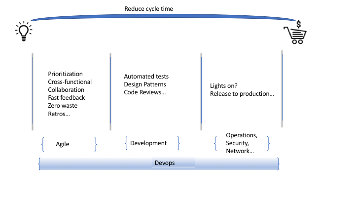

# Devops @ Myob

An introduction to my devops Journey and steps going forward

---

### Devops in a nutshell

---

Devops has four important pillars that need to be followed for a successful implementation :

 - Agile Practices
 - Continuous Integration
 - Continuous Delivery
 - Observability
